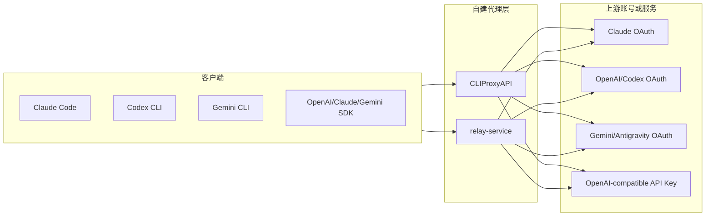

## 核心内容提炼

CLIProxyAPI 和 relay-service 都已经不只是传统的 API Key 转发器。两者都试图把 Claude Code、OpenAI Codex、Gemini CLI、Antigravity 等 OAuth/CLI 登录态包装成可被常见客户端调用的 API 服务。区别在于：CLIProxyAPI 更像轻量、通用、多协议的本地代理网关；relay-service 更像面向 Claude Code 账号池运营的完整中转平台，内置用户、API Key、用量统计、成本核算和管理后台。

如果目标是个人或少量账号本机使用、多协议快速接入，CLIProxyAPI 更轻。若目标是多人共享、额度分发、成本统计和 Web 管理，relay-service 的平台化能力更完整，但部署和运维成本也更高。

由 GPT-5 模型总结提炼，观点仅供参考。

## 背景

近期整理了两个自建 AI API 中转服务：

- `CLIProxyAPI`：已 fork 到 `https://github.com/abaolin/CLIProxyAPI`
- `relay-service`：已 fork 到 `https://github.com/abaolin/relay-service`

两者都可以让本地或服务器上的 OAuth 账号能力以 API 形式暴露给客户端，例如 Claude Code、OpenCode、Codex CLI、Gemini CLI 或其他兼容 OpenAI/Claude/Gemini 协议的工具。但它们的产品取向并不一样。

## 架构定位

CLIProxyAPI 的定位是多协议 CLI/OAuth 代理。它强调把 Gemini CLI、Claude Code、OpenAI Codex、Grok Build、Antigravity 等账号通道统一包装为 OpenAI、Responses、Gemini、Claude、Codex、Grok 等兼容接口。它用 Go 实现，部署形态偏单体服务，依赖少，适合做本地 sidecar 或轻量 API 网关。

relay-service 的定位更接近 Claude API 中转站。它源自 Claude Relay Service，核心场景是自建 Claude Code 多账号池，并给不同使用者分发独立 API Key。后续它也扩展了 Gemini、Antigravity、OpenAI/Codex、Droid、Azure、Bedrock 等链路，但管理、统计和账号池运营仍是它的主要优势。

## 能力对比

| 维度 | CLIProxyAPI | relay-service |
|---|---|---|
| 核心目标 | 通用 CLI/OAuth 到兼容 API 的代理网关 | 自建 Claude/API 中转平台 |
| 技术栈 | Go | Node.js、Redis、SQLite、Vue 管理后台 |
| 部署复杂度 | 低，单服务为主 | 中等，需要 Redis/SQLite 与后台初始化 |
| 管理后台 | 有 Management API 和相关生态 | 内置较完整 Web 管理后台 |
| 使用统计 | 新版内置统计弱化，推荐外部统计项目 | 内置 API Key、用户、模型、成本等统计 |
| OAuth 覆盖 | Claude、Codex/OpenAI、Gemini、Grok、Antigravity 等 | Claude 为核心，同时扩展 OpenAI/Codex、Gemini、Antigravity 等 |
| 协议转换 | 多协议统一暴露，覆盖面广 | OpenAI→Claude、Claude→OpenAI、Gemini→OpenAI 等转换链路较明确 |
| 多账号池 | 多账号轮询、故障切换、冷却 | 多账号、专属账号、分组、限额、成本和用量管理 |
| 适合用户 | 个人、本机 sidecar、多协议实验 | 小团队、多人共享、账号池运营 |

## 对外入口差异

CLIProxyAPI 的入口更像统一协议网关。服务启动后，用户把客户端的 base URL 指向它，再通过模型名、前缀或配置选择不同账号和上游通道。它关注的是协议兼容、账号轮询、OAuth 登录和多 provider 路由。

relay-service 的入口更像一个中转站产品：

- `/api`、`/claude`：Claude 账号池入口。
- `/antigravity/api`：强制走 Antigravity OAuth 通道。
- `/gemini-cli/api`：强制走 Gemini CLI OAuth 通道。
- `/openai`：OpenAI/Codex 相关入口。
- `/claude/openai/v1/messages`：让 Claude Code 的 Anthropic Messages 请求转成 OpenAI Chat Completions，再把响应转回 Anthropic 格式。

这意味着 relay-service 更适合把不同入口分配给不同用户或客户端，并围绕 API Key 做权限、限额、统计和审计。

## 部署资源估算

| 使用规模 | CLIProxyAPI | relay-service |
|---|---:|---:|
| 个人本机或 1-3 并发 | 1 vCPU、256-512 MB RAM、1-2 GB 磁盘 | 1 vCPU、512 MB-1 GB RAM、5-10 GB 磁盘 |
| 小团队或 5-20 并发 | 1-2 vCPU、512 MB-1 GB RAM、5 GB 磁盘 | 2 vCPU、2-4 GB RAM、20-30 GB 磁盘 |
| 多账号池和较高并发 | 2 vCPU、1-2 GB RAM | 2-4 vCPU、4-8 GB RAM |

CLIProxyAPI 是 Go 单体服务，主要资源消耗来自请求转发、流式连接和账号状态维护。个人使用时资源压力较小。

relay-service 需要运行 Node.js 服务、Redis、SQLite 元数据、Web 管理后台和统计任务。它的 README 中给出的最低配置是 1 核 CPU、512 MB 内存、30 GB 磁盘，建议至少 1 GB 内存；实际长期运行建议 2 核 4 GB 起步，特别是要保留请求详情、日志和用量统计时。

## 选型建议

选择 CLIProxyAPI 的典型场景：

- 自己使用，主要希望把多个 CLI/OAuth 账号统一成一个本地 API。
- 更看重轻量部署和多协议覆盖。
- 不需要复杂用户体系、成本分摊和后台运营。
- 希望作为其他工具的 sidecar，例如本机开发环境、IDE、agent 编排工具。

选择 relay-service 的典型场景：

- 多人共用，需要给每个人分配独立 API Key。
- 需要后台查看用量、成本、账号状态和错误记录。
- 需要模型限制、并发限制、额度限制、账号分组。
- 主要围绕 Claude Code 或 Anthropic Messages API 做中转，同时希望兼容 GPT/Gemini 等后端。

## 风险边界

这类服务的风险不在技术实现本身，而在上游账号和服务条款。把订阅账号、CLI 登录态或 OAuth 会话包装成 API 服务，可能违反对应服务商的使用条款。relay-service 的 README 已明确提示使用项目可能违反 Anthropic 服务条款，使用风险由用户自行承担。

技术上也要注意：

- 账号 token、refresh token、API Key 必须加密存储，管理后台必须限制公网访问。
- 不要把管理端口直接裸露到公网，建议放在反向代理、VPN 或内网后面。
- 日志和请求详情可能包含敏感代码、提示词和业务数据，应默认最小化保留。
- 多账号池不要只看可用性，还要关注封禁、限流、异常冷却和恢复策略。
- 上游 CLI 或 OAuth 私有协议随时可能变化，需要预留维护成本。

## 当前结论

如果只是在个人机器或轻量服务器上把 Claude Code、Codex、Gemini CLI 等账号能力接给自己的工具使用，CLIProxyAPI 是更轻的选择。

如果已经在服务器上运营 relay-service，并且需要多人共享、用量统计、API Key 权限和成本核算，relay-service 更符合长期管理需求。

两者并不是严格替代关系。更实际的理解是：

- CLIProxyAPI 是轻量通用代理。
- relay-service 是带运营后台的中转平台。

在资源足够、团队共享需求明确的情况下，relay-service 的管理能力值得付出部署成本；在个人开发和多协议实验场景下，CLIProxyAPI 的简单性更有优势。

## 原文链接

- CLIProxyAPI 上游仓库：<https://github.com/router-for-me/CLIProxyAPI>
- CLIProxyAPI 个人 fork：<https://github.com/abaolin/CLIProxyAPI>
- CLIProxyAPI 文档：<https://help.router-for.me/cn/introduction/what-is-cliproxyapi>
- relay-service 上游仓库：<https://github.com/dipinllx-source/relay-service>
- relay-service 个人 fork：<https://github.com/abaolin/relay-service>
